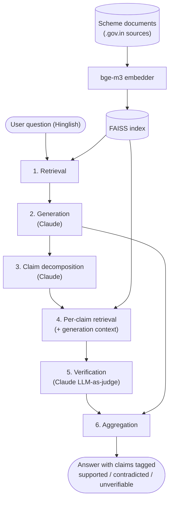
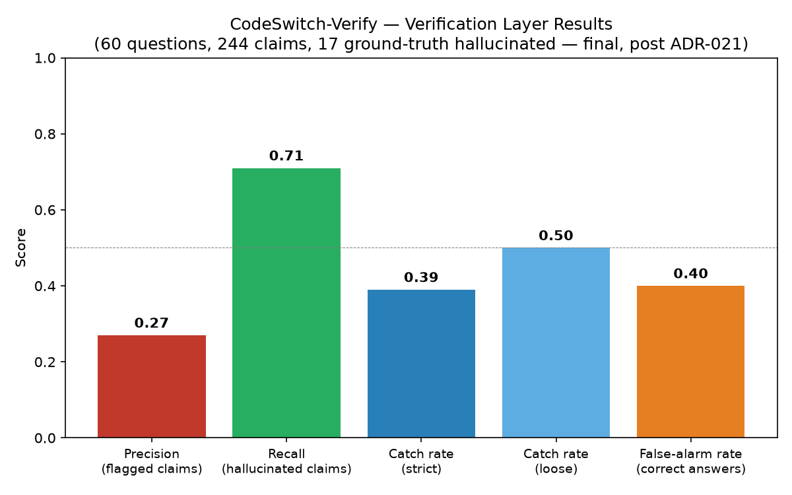

# CodeSwitch-Verify

Faithfulness-checked RAG for Hinglish government-scheme Q&A.

## Problem

RAG chatbots answering Hinglish (Hindi-English mixed) questions about Indian government schemes
generate fluent answers, but nothing checks whether every individual claim in the answer is
actually supported by the retrieved source document. An unsupported claim — a wrong eligibility
condition, a wrong deadline, a wrong amount — can pass through to the user undetected, in a domain
where being wrong has real consequences. This project adds a claim-level verification layer after
generation: every answer is broken into atomic claims, each claim is checked against retrieved
evidence, and unsupported claims are flagged instead of trusted blindly.

## Architecture



## How it works

| Component | What it does | Implementation |
|---|---|---|
| Retrieval | Embeds the question and finds the closest passages in the scheme documents | `src/retrieval.py` — bge-m3 + FAISS flat index |
| Generation | Answers the question in Hinglish, grounded only in retrieved passages | `src/generation.py` — Claude Haiku 4.5 (switched from Groq in ADR-021) |
| Claim decomposition | Splits the generated answer into atomic, independently-checkable claims | `src/decomposition.py` — `decompose_llm()` (Claude), falls back to a regex sentence/connector-word splitter |
| Per-claim retrieval | Builds each claim's evidence pool: generation's context passages merged with a fresh per-claim retrieval | `src/retrieval.py`, called per claim in `src/verification.py` (ADR-021) |
| Verification | Judges each claim against its evidence: supported / contradicted / unverifiable, with a confidence score, by majority vote over 3 samples | `src/verification.py` — Claude Haiku 4.5 as LLM-as-judge, JSON output |
| Aggregation | Combines per-claim verdicts back into the answer for display | `src/pipeline.py` |

See [`docs/contracts.md`](docs/contracts.md) for exact function signatures and data formats.

## Setup

```
uv sync
cp .env.example .env   # add your Anthropic API key
```

Fetch the scheme facts dataset live from official `.gov.in` sources (writes one CSV per scheme
to `data/schemes/`):

```
uv run scripts/fetch_scheme_data.py
```

Then build the index:

```
uv run scripts/build_index.py
```

Run tests:

```
uv run python -m pytest
```
(`uv run pytest` invokes `pytest.exe` directly, which is blocked by an Application Control
policy on this machine — use `python -m pytest` instead.)

## Project layout

```
config/         settings (model names, paths, API key loading)
src/            pipeline code (retrieval, generation, decomposition, verification, evaluation)
scripts/        CLI entry points
tests/          unit tests
data/schemes/   one CSV per scheme, structured facts fetched live from official .gov.in sources
eval/           hand-labelled evaluation set (input questions + ground-truth labels)
results/        pipeline outputs (generated answers, verifier results, computed metrics)
demo/           working demo (Objective O6)
notebooks/      exploratory/prototyping work
docs/           planning docs, decision log, contracts, per-phase notes, error analysis, figures
```

## Results

60 questions, 244 decomposed claims, 17 ground-truth hallucinated (claim-level). Every one of
the 18 non-fully_correct answers reaches the plain (unverified) baseline unflagged — the verified
pipeline's whole value is in the columns below. Ground truth is an AI-drafted first pass, pending
human review (ADR-012, ADR-014) — read `docs/report_evaluation_and_results.md` before quoting
these numbers anywhere.

These are the numbers **after seven fixes across four rounds** (ADR-015, ADR-018, ADR-019/020,
then ADR-021): splitting oversized knowledge-base rows, filtering degenerate decomposition
fragments, adding and then repairing absence-claim prompt handling, majority-vote judging, and
finally — after switching from Groq to Claude to escape Groq's repeatedly-blocking daily quota —
LLM-based decomposition, hybrid evidence retrieval (generation's context passages merged with a
fresh per-claim lookup, so verification isn't blind to whatever generation happened to retrieve),
and a genuine data-corruption fix in `PM-KISAN.csv`. The absence-claim fix initially, verified
correct in isolation, still **regressed recall (0.71→0.42)** once retrieval (deliberately left
unfixed — a real question isn't pre-labeled with its scheme) fed it wrong-scheme evidence
(ADR-017); rather than reverting, the same instruction was repaired to check topical relevance
before trusting an absence reading (ADR-018), recovering to precision 0.24 / recall 0.67.
Extending the row-splitting fix and adding majority-vote judging (ADR-019/020) left claim-level
precision/recall essentially flat (0.25/0.67) — reported honestly as a wash, not framed as
progress it didn't make. The Claude switch and hybrid-retrieval fix (ADR-021) is the first round
since the original baseline to move precision *and* recall together: **0.27 / 0.71**, the best
simultaneous result recorded in this project.

| Metric | Value |
|---|---|
| Recall on hallucinated claims | 0.71 |
| Precision on flagged claims | 0.27 |
| Answer-level catch rate (strict) | 0.39 |
| Answer-level catch rate (loose) | 0.50 |
| False-alarm rate on correct answers | 0.40 |



Full breakdown in [`results/metrics.md`](results/metrics.md); why precision is weak, what
specifically got missed or over-flagged, and the full regression story is in
[`docs/error_analysis.md`](docs/error_analysis.md).

## Final report

- [`docs/report_architecture_and_implementation.md`](docs/report_architecture_and_implementation.md)
  — system architecture, implementation notes per pipeline stage, tech stack (A4)
- [`docs/report_evaluation_and_results.md`](docs/report_evaluation_and_results.md) — evaluation
  methodology, results, limitations (B4)
- [`docs/error_analysis.md`](docs/error_analysis.md) — verifier mistakes reviewed in detail (B4)
- [`docs/slides.md`](docs/slides.md) — presentation slides (A4)

## Project status

**All 24 tasks across both tracks and all 4 weeks are done**, plus three post-submission fix
cycles that together shipped seven fixes, hit a real regression along the way, diagnosed it
precisely instead of guessing, repaired it rather than reverting, discovered the LLM judge itself
isn't fully deterministic and added majority-vote judging to address that directly, then switched
the underlying model (Groq → Claude, ADR-021) after Groq's daily quota repeatedly blocked full
runs — which also surfaced and fixed a genuine data-corruption bug and a retrieval design flaw
along the way (ADR-015 through ADR-021 — see Status log below). The second cycle (ADR-019/020)
landed roughly flat on claim-level precision/recall — reported honestly as a wash, not spun as
progress. The third (ADR-021) is the first round since the original baseline to move precision
*and* recall together, landing at the best simultaneous result recorded in the project.
Verified, not assumed: full test suite passes (`uv run python -m pytest`, 16 tests), and the
complete pipeline was run live
end-to-end (retrieval → Hinglish generation → decomposition → per-claim verification) as a final
check — see the week-by-week log below and `docs/problems_and_decisions.md` for what "done"
actually involved (multiple memory-constrained index rebuilds, a Groq model deprecation
mid-project, a corrupted source PDF, non-deterministic verifier outputs, multiple rounds of
self-correction on the error analysis, a shipped fix that regressed a headline metric, and an
environment issue that blocked a diagnostic, among other things).

**One item is deliberately not marked done, and isn't something this session can complete:**
`eval/labels.csv` and `eval/claim_ground_truth.csv` — the ground truth every precision/recall
number in this project rests on — are an AI-drafted first pass, `reviewed_by_human=FALSE` on
every row (ADR-012, ADR-014). This was an explicit choice, not an oversight: the blueprint's own
design (ADR-006) requires ground truth to come from a human specifically *because* the verifier
being measured is also an LLM — if the ground truth were AI-written too, the precision/recall
numbers would just measure two LLMs agreeing with each other, not real hallucination-catching
ability. That review is the one piece of this project that has to happen outside this session.
The 18 flagged answers (`label != fully_correct` in `eval/labels.csv`) are the highest-value
subset to check first, since they drive every downstream metric.

## Status

Week 1 done, both tracks. Track B: 60-question Hinglish evaluation set (`eval/questions.csv`)
across 4 fixed schemes, claim decomposition tested against hand-written Hinglish samples, verifier
prompt tested on 5 sample claim/evidence pairs (`scripts/test_verifier_samples.py`, 5/5 matched
expected verdict). Track A: structured scheme facts dataset — one CSV per scheme in
`data/schemes/`, 172 facts total across multiple official sources per scheme, fetched live by
`scripts/fetch_scheme_data.py` (PM-KISAN 43, Ayushman Bharat 37, PM Awas Yojana 58, Post-Matric
Scholarship 34), bge-m3 + FAISS index builds and returns sensible passages for Hinglish queries,
Groq API key confirmed working with a live chat completion call.

Week 2: Track A done — `scripts/generate_answers.py` runs the plain retrieve-then-generate
pipeline over every question in `eval/questions.csv` and writes `results/generated_answers.csv`.
All 60 answers generated, all consistently in Hinglish, no prompt tuning needed. Generation hit
Groq's free-tier 100k-tokens/day limit twice along the way (see P-001 in
`docs/problems_and_decisions.md`) — the script is resumable, so re-running it after each reset
picked up where it left off until all 60 were done.

Week 3: Track A done. Plain-RAG baseline confirmed — the 60 `pipeline == "plain"` rows in
`results/generated_answers.csv` from Week 2 are the unverified comparison condition, no separate
build needed. Demo skeleton done: `demo/app.py` (Streamlit) takes a Hinglish question, retrieves,
generates, and shows the answer plus retrieved sources — claim tags come later once B wires the
verifier in. Support/integration fixes: tested claim decomposition against all 60 real answers
and found 2 mis-split cases (P-002) — fixed the unambiguous one (an "Rs." abbreviation was
mistaken for a sentence boundary) directly with a regression test added, left the other (a
compound-subject "aur" split) alone since it's an intentionally-documented limitation owned by
B3. Along the way, found Groq had removed `llama-3.3-70b-versatile` from its catalog entirely,
breaking generation and verification for the whole team; swapped `GENERATOR_MODEL`/
`VERIFIER_MODEL` to `openai/gpt-oss-120b` (see P-003).

Week 4: Track B done. Verifier wired into the full pipeline (`scripts/verify_answers.py`) and run
on all 60 answers — 212 claims verified, resumable through a Groq TPM rate limit (P-005).
Claim-level ground truth derived (`eval/claim_ground_truth.csv`, ADR-014) since the blueprint's
answer-level labels can't compute Section 13.2's claim-level metrics directly. Precision/recall
computed (`results/metrics.md`, see Results above). Error analysis done
(`docs/error_analysis.md`) — traced the false positives to five causes across two rounds of
correction (each pass found the previous one had generalized from too small a sample — see
P-006 in `docs/problems_and_decisions.md`), then added full evidence-text logging and re-ran
verification against the P-007-corrected knowledge base to actually diagnose the previously-
"unexplained" cases (P-008): wrong-scheme retrieval (~33), decomposition damage/fragments (~13),
oversized multi-topic fact rows losing the retrieval race (part of ~12), genuine LLM-judge
misjudgment on complete correct evidence (the other part of that ~12 — a real reliability limit,
not a bug), "no info" claim mishandling (~7), plus one now-fixed stale-data artifact — and
reviewed all 7 false negatives individually. P-008 also found real run-to-run non-determinism
even at `temperature=0`. Evaluation methodology and results report sections written
(`docs/report_evaluation_and_results.md`). Results chart generated
(`docs/figures/results_chart.png`).

Track A done. Demo finished: `demo/app.py` now runs the full verified pipeline and shows each
claim colour-tagged (🟢 SUPPORTED / 🔴 CONTRADICTED / 🟡 UNVERIFIABLE) with its confidence score,
beside the plain untagged answer. Manually testing it surfaced a real data-quality bug — two
rupee amounts corrupted during PDF extraction (`Rs.6000` → `Rs.60001`) in
`data/schemes/PM-KISAN.csv` — fixed directly and documented (P-007), since a "supported, high
confidence" verdict only means a claim matches its evidence, not that the evidence is correct.
Architecture and implementation report sections written
(`docs/report_architecture_and_implementation.md`), pairing with Track B's evaluation/results
sections. Presentation slides prepared (`docs/slides.md`).

Post-submission fix cycle (ADR-015/016/017/018): implemented three of P-008's diagnosed fixes —
split the oversized Post-Matric Scholarship knowledge-base row into 12 atomic facts (confirmed
fixed the retrieval misses it caused), filtered degenerate decomposition fragments out of
verification, and added explicit verifier-prompt handling for claims describing an absence of
information. Added multi-key Groq failover (`GROQ_API_KEY_2`/`_3`/`_4`, ADR-016) to get full
209-claim re-verifications done same-day against Groq's daily quota. First measured result:
precision 0.21→0.18, recall **0.71→0.42** — two fixes worked as designed, the third (verified
correct in isolation) regressed recall because it interacted with wrong-scheme retrieval,
deliberately left unfixed. 9 of 14 new false negatives had wrong-scheme evidence: bad evidence
genuinely doesn't discuss a claim's real topic, and the new prompt told the judge to trust that
absence confidently instead of hedging (full mechanism in ADR-017). An eval-only scheme-filtered
retrieval diagnostic was built to isolate the effect but didn't finish (blocked by a persistent
Windows Application Control policy on native DLLs, an environment issue) — turned out not to be
needed. **Fixed, not reverted (ADR-018):** added a relevance check to the same instruction —
verify the evidence is about the claim's scheme before trusting its silence — verified directly
against the real failing case, then re-measured end-to-end. **Result: precision 0.24,
recall 0.67, false positives 65→50, false-alarm rate 0.57→0.50** — better than the original
pre-fix baseline on precision, false positives, and false-alarm rate, with recall recovered to
within 4 points of where the project started. Full account in ADR-017/ADR-018
(`docs/problems_and_decisions.md`).

Second post-submission fix cycle (ADR-019/020): extended the row-splitting fix to PM-KISAN's and
PM Awas Yojana's remaining oversized rows (dataset grew from 183 to 197 atomic facts), then, while
measuring that change, found direct proof the LLM judge isn't fully deterministic even at
`temperature=0` — 12 of 20 verdict flips between two runs had byte-identical evidence text, so the
same claim against the same evidence produced a different verdict purely from re-running the
judge. That meant the row-split's own before/after comparison was mostly noise, not a real signal
either way. Added majority-vote judging (`verify_claim()` now takes the majority of 3 independent
judge calls, ADR-020) to address the noise directly — feasible cost-wise only because of ADR-016's
multi-key failover, and even then the 3x API cost repeatedly hit Groq's daily quota, spreading the
full 209-claim re-verification across two days and several resume cycles. **Final result:
precision 0.25, recall 0.67, false positives 49, false-alarm rate 0.48** — claim-level numbers
essentially flat versus ADR-018, though answer-level catch rate dipped slightly (strict 0.50→0.44,
loose 0.78→0.72) despite identical true/false-negative counts, because which specific claims got
caught shifted between runs. Reported as a wash, not a further improvement — full account in
ADR-019/ADR-020 (`docs/problems_and_decisions.md`).

Third post-submission fix cycle (ADR-021): switched `src/generation.py`, `src/decomposition.py`,
and `src/verification.py` from Groq to Claude (Haiku 4.5) after Groq's daily quota repeatedly
paused full runs across several days. Along with the switch: LLM-based decomposition
(`decompose_llm()`) replacing the regex splitter as the pipeline's actual step, fixing
qualifier-dropping and claim-bundling bugs at the root; and a hybrid evidence-retrieval design in
`verify_claim()` that merges the passages generation actually retrieved with a fresh per-claim
lookup. The context-passages-only version was tried first and initially regressed recall
(0.67→0.50) — diagnosed directly by reading evidence text: it tied verification's blind spots to
generation's, so a fact generation's retrieval missed was invisible to verification too, even
when it existed elsewhere in the corpus. Fixed (not reverted) by merging in a fresh per-claim
retrieval alongside the context passages. While diagnosing this, found and fixed a genuine data
corruption bug in `PM-KISAN.csv` — a row titled "exclusion criteria" had a mismatched body text
duplicating a different fact, sourced from the same malformed PDF P-007 already flagged. **Final
result: precision 0.27, recall 0.71, false positives 32, false negatives 5** — the best precision
and recall simultaneously recorded in this project's history, beating both the Groq/majority-vote
result and the original pre-fix baseline. Answer-level catch rate moved the other way (strict
0.44→0.39, loose 0.72→0.50), an expected side effect of precision improving — fewer false
positives means fewer of the 18 flagged answers get an unrelated claim flagged by chance. Full
account in ADR-021 (`docs/problems_and_decisions.md`); results above reflect this final, reported
state.

See [`docs/problems_and_decisions.md`](docs/problems_and_decisions.md) for the running decision
log.
