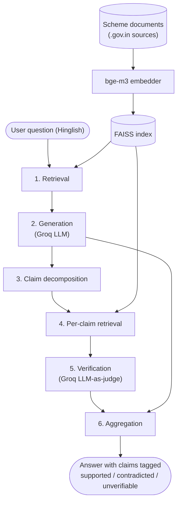

# CodeSwitch-Verify

Faithfulness-checked RAG for Hinglish government-scheme Q&A.

## Problem

RAG chatbots answering Hinglish (Hindi-English mixed) questions about Indian government schemes
generate fluent answers, but nothing checks whether every individual claim in the answer is
actually supported by the retrieved source document. An unsupported claim — a wrong eligibility
condition, a wrong deadline, a wrong amount — can pass through to the user undetected, in a domain
where being wrong has real consequences. This project adds a claim-level verification layer after
generation: every answer is broken into atomic claims, each claim is checked against retrieved
evidence, and unsupported claims are flagged instead of trusted blindly.

## Architecture



## How it works

| Component | What it does | Implementation |
|---|---|---|
| Retrieval | Embeds the question and finds the closest passages in the scheme documents | `src/retrieval.py` — bge-m3 + FAISS flat index |
| Generation | Answers the question in Hinglish, grounded only in retrieved passages | `src/generation.py` — Groq `llama-3.3-70b-versatile` |
| Claim decomposition | Splits the generated answer into atomic, independently-checkable claims | `src/decomposition.py` — sentence + connector-word rules |
| Per-claim retrieval | Re-retrieves evidence specific to each individual claim | `src/retrieval.py`, called per claim in `src/verification.py` |
| Verification | Judges each claim against its evidence: supported / contradicted / unverifiable, with a confidence score | `src/verification.py` — Groq LLM-as-judge, JSON output |
| Aggregation | Combines per-claim verdicts back into the answer for display | `src/pipeline.py` |

See [`docs/contracts.md`](docs/contracts.md) for exact function signatures and data formats.

## Setup

```
uv sync
cp .env.example .env   # add your Groq API key
```

Add scheme documents (plain text) to `data/schemes/`, then build the index:

```
uv run scripts/build_index.py
```

Run tests:

```
uv run python -m pytest
```
(`uv run pytest` invokes `pytest.exe` directly, which is blocked by an Application Control
policy on this machine — use `python -m pytest` instead.)

## Project layout

```
config/         settings (model names, paths, API key loading)
src/            pipeline code (retrieval, generation, decomposition, verification, evaluation)
scripts/        CLI entry points
tests/          unit tests
data/schemes/   source government scheme documents
eval/           hand-labelled evaluation set
docs/           planning docs, decision log, contracts, per-phase notes, figures
```

## Results

Not yet available — pipeline is in Week 1 of a 4-week build. Results will be filled in as each
objective closes out; see `docs/objective1_result.md` through `docs/objective6_result.md`.

| Metric | Plain RAG | Verified RAG |
|---|---|---|
| Recall on hallucinated claims | — | — |
| Precision on flagged claims | — | — |
| Answer-level catch rate | — | — |

## Status

Week 1: project scaffold + retrieval/generation/verification skeleton in place. Scheme documents
and the evaluation question set are next. See [`docs/problems_and_decisions.md`](docs/problems_and_decisions.md)
for the running decision log, and `docs/A*`/`docs/B*` for per-week task tracking.
