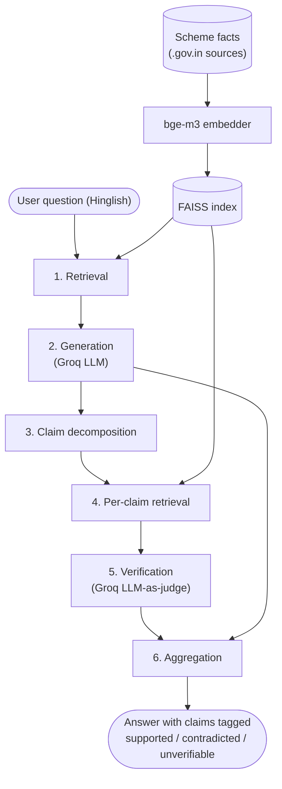

# Architecture and Implementation

Track A's sections of the final report — pairs with Track B's evaluation methodology and
results sections (`docs/report_evaluation_and_results.md`, B4). Together with
`docs/error_analysis.md` these cover the blueprint's Section 18 report requirement: architecture,
evaluation methodology, results, and an honest discussion of limitations and error cases.

## System Architecture

CodeSwitch-Verify runs every question through six stages:

1. **Retrieval** — embed the question, find the closest passages in the scheme knowledge base.
2. **Generation** — answer in Hinglish, grounded only in the retrieved passages.
3. **Claim decomposition** — split the generated answer into atomic, independently-checkable
   claims.
4. **Per-claim retrieval** — re-query the index with each individual claim (not a reuse of stage
   1's passages — ADR-005: the passage that best supports the whole answer isn't always the one
   that supports any single claim inside it).
5. **Verification** — an LLM-judge decides SUPPORTED / CONTRADICTED / UNVERIFIABLE for each claim
   against its own retrieved evidence, with a confidence score.
6. **Aggregation** — combine per-claim verdicts back into the answer for display, alongside the
   plain untagged answer for comparison (`src/pipeline.py::answer_question()`).

This mirrors the blueprint's Section 10 method pipeline exactly; no stage was added, removed, or
reordered during implementation.

## Implementation, stage by stage

### Knowledge base (`data/schemes/*.csv`)

One CSV per scheme (PM-KISAN, Ayushman Bharat, PM Awas Yojana, Post-Matric Scholarship — ADR-009),
183 atomic facts total (originally 172 — one oversized, multi-topic row later split into 12
atomic facts, ADR-015), each row one `category`/`fact`/`source_url`. Built by
`scripts/fetch_scheme_data.py`, which fetches each scheme's real official `.gov.in` source (PDF
guidelines, FAQ pages) live over HTTP and parses it with one of five pattern-matching heuristics —
`faq` (numbered Q&A), `sections` (lettered/roman-numeral clause headers), `clauses` (decimal
clause numbering like `5.1.6`), `numbered` (plain numbered statements), `bullets` (one fact per
line) — rather than being hand-written (ADR-011). Re-running the script re-derives the dataset
from the live source rather than trusting a stale local copy.

This scraped-not-authored approach traded convenience for a real data-quality risk that surfaced
in Week 4: `pypdf`'s extraction of one structurally malformed source PDF silently corrupted two
rupee amounts (`Rs.6000` → `Rs.60001`), which then propagated cleanly through retrieval,
generation, and verification — the LLM-judge correctly confirmed a claim against wrong evidence,
because the evidence itself was wrong (P-007). Caught by chance during manual demo testing, not
by the 60-question evaluation set, which is itself worth disclosing as a limitation.

### Retrieval (`src/retrieval.py`)

`BAAI/bge-m3` (pretrained, multilingual, run locally, no fine-tuning — ADR-002) embeds every fact
and every query into one shared vector space; a FAISS `IndexFlatIP` over normalized embeddings
does brute-force cosine similarity (ADR-004 — appropriate at 183 facts, would need revisiting at
real scale). Because facts are already atomic (one row = one short statement), each row is
embedded directly with no chunking step.

### Generation (`src/generation.py`)

A single prompt instructs the model to answer in Hinglish, grounded only in the given context, and
to say so plainly rather than guess when the context doesn't answer the question. Originally
Groq's `llama-3.3-70b-versatile`; mid-Week-3 Groq removed that model from its catalog entirely
with no warning, breaking every generation and verification call project-wide. Both
`GENERATOR_MODEL` and `VERIFIER_MODEL` were swapped to `openai/gpt-oss-120b` after testing it (and
a smaller/reasoning alternative) for Hinglish fluency and, separately, strict-JSON compliance on
the verifier prompt (P-003) — the same-model-for-both-roles decision from ADR-001 was kept, not
revisited, since nothing about the failure was specific to one role.

### Claim decomposition (`src/decomposition.py`)

Rule-based: split on sentence boundaries, then further split each sentence on a fixed Hinglish/
English connector-word list (`aur`, `lekin`, `but`, `however`, ...) — deliberately not a trained
parser, since a full linguistic parser is unnecessary engineering at this scope (ADR-003).
Two real bugs surfaced testing this against actual generated output rather than only
hand-written samples: an abbreviation like "Rs." was being read as a sentence boundary
(fixed directly, with a regression test — P-002), and splitting on "aur" inside a compound subject
or a qualifier like "only X and Y" produces individually-true fragments that lose the original
claim's meaning (left as a documented, tested limitation — ADR-003, revisited in
`docs/error_analysis.md` as a concrete cause of 2 of the verifier's 6 false negatives). The
abbreviation case had a safe, unambiguous fix with no test asserting the broken behavior; the
connector case already had one, which is why it wasn't touched.

### Per-claim retrieval and verification (`src/retrieval.py`, `src/verification.py`)

Each claim is re-embedded and re-queried against the same index (`verify_claim()`, `top_k=2` by
default), and the LLM-judge (`judge()`) is prompted to return strict JSON —
`{"verdict": ..., "confidence": ...}` — for the claim against its retrieved evidence text, at
temperature 0 for determinism. `judge()` and `verify_claim()` were split apart early (ADR-010) so
the verifier prompt could be tested on 5 hand-written claim/evidence pairs before any retrieval
index existed. Running this at full scale (~210 claims across 60 answers) needed two kinds of
resilience neither showed up in small-scale testing: retrying through Groq's short-burst
tokens-per-minute limit with exponential backoff, and separately, making every batch-driving
script resumable to survive Groq's much longer daily-quota limit, since both were hit repeatedly
across Weeks 2–4 (P-001, P-005).

### Aggregation (`src/pipeline.py`)

`answer_question(question, index, passages, verify=True)` runs stages 1–2 unconditionally, then
stages 3–5 only if `verify=True`, returning `{"question", "answer", "context_passages", "claims"}`
— `claims` absent when `verify=False`. This single function backs both the plain-RAG baseline
(`verify=False`, used by `scripts/generate_answers.py`, A2) and the finished demo's verified mode,
so there's exactly one code path producing answers, not two that could drift apart.

### Demo (`demo/app.py`)

A Streamlit app: a Hinglish question in, a checkbox to toggle verification on or off, the plain
answer, and — when verification is on — each decomposed claim shown with a colour tag
(🟢 SUPPORTED / 🔴 CONTRADICTED / 🟡 UNVERIFIABLE) and its confidence score, plus the retrieved
source passages in a collapsible section. Streamlit was picked over Gradio or a notebook as the
fastest path to wiring `answer_question()` up to something clickable at this scale (demo/README).
The skeleton (question in, answer out, no verification) was built in Week 3 (A3); claim
colour-tagging was added in Week 4 (A4) once the verifier was wired into the pipeline. One
non-obvious fix was needed to make the demo usable at all: Streamlit's default file watcher
repeatedly scans the entire installed `transformers` package tree (a side effect of
`sentence-transformers` being a dependency) on every file-change check, which was slow enough to
visibly delay the page mounting — disabled via `.streamlit/config.toml` since this demo has no
live-reload workflow to protect anyway.

## Tech stack

| Component | Choice | Why |
|---|---|---|
| Language | Python | Matches blueprint Section 15 |
| Generator + verifier | Groq API, `openai/gpt-oss-120b` | Free tier, fast, no GPU; swapped from `llama-3.3-70b-versatile` after Groq removed it (P-003) |
| Embeddings | `BAAI/bge-m3`, local | Free, pretrained, handles Hindi-English mixed text without fine-tuning |
| Vector store | FAISS (`faiss-cpu`), local, in-memory | No server needed at 183-fact scale |
| Claim decomposition | Rule-based Python | Transparent, debuggable, sufficient at this scope |
| Demo | Streamlit | Fastest framework to wire to the existing pipeline function |
| Dependency management | `uv` + `pyproject.toml` | Reproducible lockfile, single tool for venv + deps + running scripts |
| Testing | `pytest` (14 tests, `tests/`) | Covers decomposition edge cases and evaluation math |

No component was trained or fine-tuned — every model is pretrained and reused as-is, matching the
blueprint's explicit out-of-scope statement.

## Problems overcome during implementation

Full detail in `docs/problems_and_decisions.md`; summarized here as part of the implementation
story rather than duplicated:

- **P-001 / P-005** — Groq's free tier has two independent limits that need opposite handling: a
  rolling daily token quota (wait out the countdown, don't retry immediately) and a short-burst
  tokens-per-minute limit (retry with exponential backoff works fine). Every long-running batch
  script (`generate_answers.py`, `verify_answers.py`) needed to be resumable, not as a
  nice-to-have but because a partial run interrupted by a rate limit was the normal case, not the
  exception.
- **P-002** — claim decomposition mis-split on an abbreviation period; fixed with a regression
  test, distinguished from a second, structurally different mis-split case that was deliberately
  left alone because a test already documented it as an accepted limitation.
- **P-003** — Groq silently removed the model the entire pipeline depended on mid-project;
  required testing replacement models on both Hinglish fluency and strict-JSON output before
  picking one, not just swapping in whatever worked first.
- **P-004 / P-006 / P-008** — the low precision on flagged claims traces to five distinct causes,
  found across two rounds of correcting an initial estimate that generalized from too few
  examples, then a targeted re-run with added evidence-text logging (P-008) that actually
  diagnosed what two more rounds of guessing couldn't: wrong-scheme retrieval (short, generic
  claims don't carry enough scheme-specific vocabulary for dense retrieval to anchor correctly),
  genuine decomposition damage (fragments too incomplete to verify), oversized multi-topic
  knowledge-base rows losing the retrieval race to shorter but wrong facts (a data-granularity
  issue P-008 confirmed reproducible), genuine LLM-judge misjudgment on claims given the fully
  correct evidence (a real reliability limit on the method, not fixable by more engineering), the
  verifier mishandling claims that describe an absence of information (in both directions — it
  both over-flags true ones and accepts false ones), and one now-fixed stale-data artifact
  (P-007). P-008 also found real run-to-run non-determinism in the verifier even at
  `temperature=0`. All retrieval/decomposition/verification quality findings, not implementation
  bugs — detailed in `docs/error_analysis.md`.
- **ADR-015 / ADR-017** — implemented fixes for three of P-008's diagnosed causes (knowledge-base
  row split, decomposition fragment filter, absence-claim prompt handling) and measured the
  result end-to-end rather than assuming the fixes worked: precision 0.21→0.18, recall
  **0.71→0.42**. The knowledge-base split and fragment filter worked as designed; the
  absence-claim prompt, verified correct in isolation, regressed recall because it interacts with
  wrong-scheme retrieval (deliberately left unfixed — real deployment can't know a question's
  scheme in advance). Shipped and disclosed as-is rather than reverted, since reverting would hide
  the retrieval problem behind a less decisive judge rather than fix it. An eval-only
  scheme-filtered retrieval diagnostic (`scripts/diagnostic_scheme_filtered_verify.py`) was built
  to isolate the effect but didn't finish, blocked by a persistent Windows Application Control
  policy on native DLLs (`faiss`, then `pandas`) — an environment problem, not a code one.
- **P-007** — a malformed source PDF silently corrupted two figures in the scraped knowledge base;
  caught by chance during manual testing, which is itself evidence that the scraped-not-authored
  knowledge base needed (and didn't get, beyond one spot-check) systematic verification against
  its sources.

## Limitations (architecture and implementation side)

- The knowledge base is scraped from live `.gov.in` sources with heuristic parsing, not hand
  -authored or exhaustively verified — P-007 shows this can silently introduce wrong facts that
  every downstream stage then treats as ground truth.
- Claim decomposition is rule-based and has known, documented failure modes on compound and
  qualifier-bearing sentences (ADR-003) that a trained parser would likely avoid, traded
  deliberately for transparency and debuggability at this project's scope.
- Generator and verifier share one model and one API key; a transient Groq catalog or quota
  change affects both roles simultaneously, as P-003 demonstrated.
- See `docs/report_evaluation_and_results.md` for evaluation-side limitations (ground truth
  provenance, sample size, retrieval/verification entanglement).
