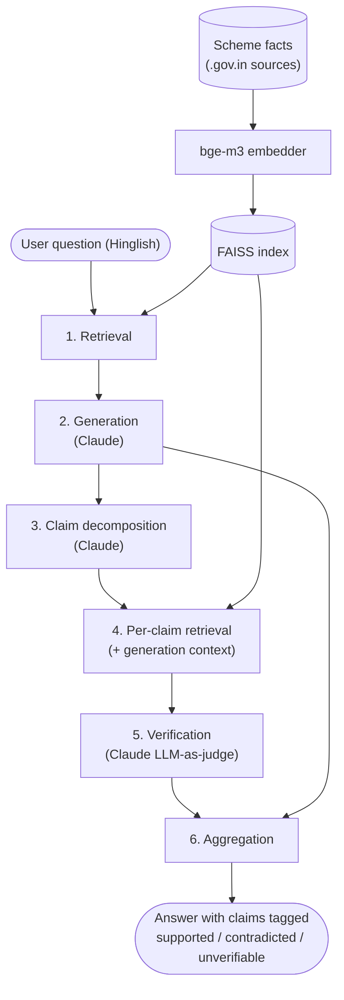

# Architecture and Implementation

Track A's sections of the final report — pairs with Track B's evaluation methodology and
results sections (`docs/report_evaluation_and_results.md`, B4). Together with
`docs/error_analysis.md` these cover the blueprint's Section 18 report requirement: architecture,
evaluation methodology, results, and an honest discussion of limitations and error cases.

## System Architecture

CodeSwitch-Verify runs every question through six stages:

1. **Retrieval** — embed the question, find the closest passages in the scheme knowledge base.
2. **Generation** — answer in Hinglish, grounded only in the retrieved passages.
3. **Claim decomposition** — split the generated answer into atomic, independently-checkable
   claims.
4. **Per-claim retrieval** — re-query the index with each individual claim (not a reuse of stage
   1's passages — ADR-005: the passage that best supports the whole answer isn't always the one
   that supports any single claim inside it).
5. **Verification** — an LLM-judge decides SUPPORTED / CONTRADICTED / UNVERIFIABLE for each claim
   against its own retrieved evidence, with a confidence score.
6. **Aggregation** — combine per-claim verdicts back into the answer for display, alongside the
   plain untagged answer for comparison (`src/pipeline.py::answer_question()`).

This mirrors the blueprint's Section 10 method pipeline exactly; no stage was added, removed, or
reordered during implementation.

## Implementation, stage by stage

### Knowledge base (`data/schemes/*.csv`)

One CSV per scheme (PM-KISAN, Ayushman Bharat, PM Awas Yojana, Post-Matric Scholarship — ADR-009),
183 atomic facts total (originally 172 — one oversized, multi-topic row later split into 12
atomic facts, ADR-015), each row one `category`/`fact`/`source_url`. Built by
`scripts/fetch_scheme_data.py`, which fetches each scheme's real official `.gov.in` source (PDF
guidelines, FAQ pages) live over HTTP and parses it with one of five pattern-matching heuristics —
`faq` (numbered Q&A), `sections` (lettered/roman-numeral clause headers), `clauses` (decimal
clause numbering like `5.1.6`), `numbered` (plain numbered statements), `bullets` (one fact per
line) — rather than being hand-written (ADR-011). Re-running the script re-derives the dataset
from the live source rather than trusting a stale local copy.

This scraped-not-authored approach traded convenience for a real data-quality risk that surfaced
in Week 4: `pypdf`'s extraction of one structurally malformed source PDF silently corrupted two
rupee amounts (`Rs.6000` → `Rs.60001`), which then propagated cleanly through retrieval,
generation, and verification — the LLM-judge correctly confirmed a claim against wrong evidence,
because the evidence itself was wrong (P-007). Caught by chance during manual demo testing, not
by the 60-question evaluation set, which is itself worth disclosing as a limitation.

### Retrieval (`src/retrieval.py`)

`BAAI/bge-m3` (pretrained, multilingual, run locally, no fine-tuning — ADR-002) embeds every fact
and every query into one shared vector space; a FAISS `IndexFlatIP` over normalized embeddings
does brute-force cosine similarity (ADR-004 — appropriate at 183 facts, would need revisiting at
real scale). Because facts are already atomic (one row = one short statement), each row is
embedded directly with no chunking step.

### Generation (`src/generation.py`)

A single prompt instructs the model to answer in Hinglish, grounded only in the given context, and
to say so plainly rather than guess when the context doesn't answer the question. Originally
Groq's `llama-3.3-70b-versatile`; mid-Week-3 Groq removed that model from its catalog entirely
with no warning, breaking every generation and verification call project-wide, then swapped to
`openai/gpt-oss-120b` (P-003). Switched again post-submission, this time off Groq entirely, to
Claude (`claude-haiku-4-5`) after Groq's free-tier daily quota repeatedly paused full evaluation
runs across several days even with multi-key failover (ADR-021) — the same-model-for-all-roles
decision from ADR-001 was kept through both switches, since nothing about either failure was
specific to one role.

### Claim decomposition (`src/decomposition.py`)

Two implementations now exist. The original is rule-based: split on sentence boundaries, then
further split each sentence on a fixed Hinglish/English connector-word list (`aur`, `lekin`,
`but`, `however`, ...) — deliberately not a trained parser at first, since a full linguistic
parser looked like unnecessary engineering at that scope (ADR-003). Two real bugs surfaced testing
this against actual generated output rather than only hand-written samples: an abbreviation like
"Rs." was being read as a sentence boundary (fixed directly, with a regression test — P-002), and
splitting on "aur" inside a compound subject or a qualifier like "only X and Y" produces
individually-true fragments that lose the original claim's meaning (left as a documented, tested
limitation at the time — ADR-003). `decompose()` is kept (still tested, zero API cost) but is no
longer the pipeline's actual decomposition step — `decompose_llm()` replaced it in ADR-021,
targeting exactly the qualifier-dropping and claim-bundling bugs above via an LLM prompt instead
of pattern rules, verified directly against both cases (and a true-exclusivity case that an
earlier prompt draft got wrong) before rollout. `decompose_llm()` falls back to `decompose()` on a
malformed or empty LLM response.

### Per-claim retrieval and verification (`src/retrieval.py`, `src/verification.py`)

`verify_claim()` builds each claim's evidence pool from two sources merged and deduplicated: the
passages generation actually retrieved for the question (`context_passages`) and a fresh
`retrieve()` call scoped to the claim's own text. This replaced two earlier, simpler designs in
turn (ADR-021): plain per-claim retrieval alone (the original design) let a short, scheme-ambiguous
claim's own retrieval pull in wrong-scheme evidence — the single largest diagnosed false-positive
cause; context-passages-alone (tried first as the fix) solved that but tied verification's blind
spots to generation's, so a fact generation's retrieval missed was invisible to verification too,
confirmed directly by reading `evidence_text` for the resulting false negatives — the merge keeps
both properties. The LLM-judge (`judge()`) is prompted to return strict JSON —
`{"verdict": ..., "confidence": ...}` — for the claim against its evidence text. `temperature=0`
was used with Groq but does not actually make the judge deterministic in practice — P-008 first
noticed run-to-run verdict drift on identical input, and ADR-019 confirmed it directly
(byte-identical evidence text produced a different verdict on 12 of 20 changed claims across two
runs); the Claude SDK version in use has since removed `temperature` from the API entirely.
`verify_claim()` judges each claim `n_samples=3` times and takes the majority verdict (ADR-020),
falling back to UNVERIFIABLE on a full 3-way split, to reduce how much a single unlucky sample can
move the measured result. `judge()` and `verify_claim()` were split apart early (ADR-010) so the
verifier prompt could be tested on 5 hand-written claim/evidence pairs before any retrieval index
existed — `judge()` itself is still the single-call primitive used for that kind of direct prompt
testing; only `verify_claim()` does the evidence-merging and majority-vote sampling. Running this
at full scale (~210-244 claims across 60 answers) needed resilience that didn't show up in
small-scale testing: on Groq, retrying through its short-burst tokens-per-minute limit with
exponential backoff, and separately, making every batch-driving script resumable to survive its
much longer
daily-quota limit, since both were hit repeatedly across Weeks 2–4 (P-001, P-005) — and again after
majority voting tripled per-claim API cost (ADR-020).

### Aggregation (`src/pipeline.py`)

`answer_question(question, index, passages, verify=True)` runs stages 1–2 unconditionally, then
stages 3–5 only if `verify=True`, returning `{"question", "answer", "context_passages", "claims"}`
— `claims` absent when `verify=False`. This single function backs both the plain-RAG baseline
(`verify=False`, used by `scripts/generate_answers.py`, A2) and the finished demo's verified mode,
so there's exactly one code path producing answers, not two that could drift apart.

### Demo (`demo/app.py`)

A Streamlit app: a Hinglish question in, a checkbox to toggle verification on or off, the plain
answer, and — when verification is on — each decomposed claim shown with a colour tag
(🟢 SUPPORTED / 🔴 CONTRADICTED / 🟡 UNVERIFIABLE) and its confidence score, plus the retrieved
source passages in a collapsible section. Streamlit was picked over Gradio or a notebook as the
fastest path to wiring `answer_question()` up to something clickable at this scale (demo/README).
The skeleton (question in, answer out, no verification) was built in Week 3 (A3); claim
colour-tagging was added in Week 4 (A4) once the verifier was wired into the pipeline. One
non-obvious fix was needed to make the demo usable at all: Streamlit's default file watcher
repeatedly scans the entire installed `transformers` package tree (a side effect of
`sentence-transformers` being a dependency) on every file-change check, which was slow enough to
visibly delay the page mounting — disabled via `.streamlit/config.toml` since this demo has no
live-reload workflow to protect anyway.

## Tech stack

| Component | Choice | Why |
|---|---|---|
| Language | Python | Matches blueprint Section 15 |
| Generator + decomposer + verifier | Anthropic API, `claude-haiku-4-5` | Switched from Groq's `openai/gpt-oss-120b` (ADR-021) after its free-tier daily quota repeatedly blocked full evaluation runs; workload cost is well under $1 on Haiku's pricing |
| Embeddings | `BAAI/bge-m3`, local | Free, pretrained, handles Hindi-English mixed text without fine-tuning |
| Vector store | FAISS (`faiss-cpu`), local, in-memory | No server needed at ~196-fact scale |
| Claim decomposition | LLM-based (`decompose_llm()`), rule-based Python as fallback | LLM handles qualifier-preservation and claim-bundling correctly where fixed rules couldn't (ADR-021); rule-based path kept for zero-cost, deterministic use and as a safety net |
| Demo | Streamlit | Fastest framework to wire to the existing pipeline function |
| Dependency management | `uv` + `pyproject.toml` | Reproducible lockfile, single tool for venv + deps + running scripts |
| Testing | `pytest` (16 tests, `tests/`) | Covers decomposition edge cases and evaluation math |

No component was trained or fine-tuned — every model is pretrained and reused as-is, matching the
blueprint's explicit out-of-scope statement.

## Problems overcome during implementation

Full detail in `docs/problems_and_decisions.md`; summarized here as part of the implementation
story rather than duplicated:

- **P-001 / P-005** — Groq's free tier has two independent limits that need opposite handling: a
  rolling daily token quota (wait out the countdown, don't retry immediately) and a short-burst
  tokens-per-minute limit (retry with exponential backoff works fine). Every long-running batch
  script (`generate_answers.py`, `verify_answers.py`) needed to be resumable, not as a
  nice-to-have but because a partial run interrupted by a rate limit was the normal case, not the
  exception.
- **P-002** — claim decomposition mis-split on an abbreviation period; fixed with a regression
  test, distinguished from a second, structurally different mis-split case that was deliberately
  left alone because a test already documented it as an accepted limitation.
- **P-003** — Groq silently removed the model the entire pipeline depended on mid-project;
  required testing replacement models on both Hinglish fluency and strict-JSON output before
  picking one, not just swapping in whatever worked first.
- **P-004 / P-006 / P-008** — the low precision on flagged claims traces to five distinct causes,
  found across two rounds of correcting an initial estimate that generalized from too few
  examples, then a targeted re-run with added evidence-text logging (P-008) that actually
  diagnosed what two more rounds of guessing couldn't: wrong-scheme retrieval (short, generic
  claims don't carry enough scheme-specific vocabulary for dense retrieval to anchor correctly),
  genuine decomposition damage (fragments too incomplete to verify), oversized multi-topic
  knowledge-base rows losing the retrieval race to shorter but wrong facts (a data-granularity
  issue P-008 confirmed reproducible), genuine LLM-judge misjudgment on claims given the fully
  correct evidence (a real reliability limit on the method, not fixable by more engineering), the
  verifier mishandling claims that describe an absence of information (in both directions — it
  both over-flags true ones and accepts false ones), and one now-fixed stale-data artifact
  (P-007). P-008 also found real run-to-run non-determinism in the verifier even at
  `temperature=0`. All retrieval/decomposition/verification quality findings, not implementation
  bugs — detailed in `docs/error_analysis.md`.
- **ADR-015 / ADR-017 / ADR-018** — implemented fixes for three of P-008's diagnosed causes
  (knowledge-base row split, decomposition fragment filter, absence-claim prompt handling) and
  measured the result end-to-end rather than assuming the fixes worked: precision 0.21→0.18,
  recall **0.71→0.42**. The knowledge-base split and fragment filter worked as designed; the
  absence-claim prompt, verified correct in isolation, regressed recall because it interacted
  with wrong-scheme retrieval (deliberately left unfixed — real deployment can't know a
  question's scheme in advance). An eval-only scheme-filtered retrieval diagnostic
  (`scripts/diagnostic_scheme_filtered_verify.py`) was built to isolate the effect but didn't
  finish, blocked by a persistent Windows Application Control policy on native DLLs (`faiss`,
  then `pandas`) — an environment problem, not a code one. Repaired rather than reverted: added
  one precondition to the same instruction — check the evidence is about the claim's scheme
  before trusting its silence — verified against the actual failing case, then re-measured
  end-to-end. **Result: precision 0.24, recall 0.67, false positives 65→50, false-alarm rate
  0.57→0.50** — better than the original on three of four axes, with recall recovered to within
  4 points of it. The scheme-filtered diagnostic turned out unnecessary once this smaller,
  targeted fix answered the underlying question directly.
- **ADR-019 / ADR-020** — a second post-submission cycle. Extended the row-splitting fix to
  PM-KISAN's and PM Awas Yojana's remaining oversized rows (183→197 facts), then measuring it
  produced direct proof the judge isn't fully deterministic even at `temperature=0` (12 of 20
  verdict changes between two runs had byte-identical evidence text). Added majority-vote judging
  (`verify_claim()` now takes the majority of 3 independent judge calls) to address that noise.
  **Final: precision 0.25, recall 0.67, false positives 49, false-alarm rate 0.48** — claim-level
  numbers roughly flat versus the ADR-018 state (a wash, not a further win), with answer-level
  catch rate slightly lower (0.50→0.44) despite an identical true/false-negative count, because
  the specific claims caught shifted between runs. Reported plainly rather than framed as
  progress it didn't demonstrate — kept for the underlying engineering soundness, not a score
  claim. Getting one full majority-voted run measured took two calendar days and several resume
  cycles, hitting both Groq's daily quota (majority voting triples API cost) and a low-free-RAM
  DLL failure loading the embedding model — both survived by the existing resumable-script
  design, no new code needed.
- **ADR-021** — a third post-submission cycle, and the first to move precision and recall
  together. Switched Groq → Claude (Haiku 4.5) after its daily quota kept blocking full runs;
  replaced the regex decomposition with an LLM-based one (`decompose_llm()`), fixing
  qualifier-dropping and claim-bundling bugs at the root; and changed `verify_claim()`'s evidence
  pool from context-passages-only (tried first, regressed recall 0.67→0.50 by tying
  verification's blind spots to generation's) to a hybrid merge of context passages and a fresh
  per-claim retrieval. While diagnosing that regression, found and fixed a real data-corruption
  bug in `PM-KISAN.csv` (a row titled "exclusion criteria" had a mismatched body, sourced from
  the same malformed PDF as P-007). **Final: precision 0.27, recall 0.71, false positives 32,
  false negatives 5** — the best precision and recall recorded simultaneously anywhere in the
  project, at the cost of a lower answer-level catch rate at first (an expected side effect of
  fewer false positives, not a new problem).
- **ADR-022** — human review of `eval/labels.csv`'s 18 non-`fully_correct` rows (the ones that
  drive every answer-level metric), closing the gap ADR-006 requires: ground truth independent of
  the LLM being measured. 16 confirmed, 2 corrected (`partially_hallucinated` → `fully_correct`).
  Claim-level precision/recall unaffected (0.27/0.71 unchanged); answer-level catch rate corrected
  to strict 0.44 / loose 0.56, false-alarm rate to 0.39 — purely from fixing the denominator, not
  from any verifier change. Also fixed a second hardcoded-count bug in `compute_metrics.py`. The
  other 42 answer-level rows and the full claim-level ground truth remain AI-drafted.
- **P-007** — a malformed source PDF silently corrupted two figures in the scraped knowledge base;
  caught by chance during manual testing, which is itself evidence that the scraped-not-authored
  knowledge base needed (and didn't get, beyond one spot-check) systematic verification against
  its sources.

## Limitations (architecture and implementation side)

- The knowledge base is scraped from live `.gov.in` sources with heuristic parsing, not hand
  -authored or exhaustively verified — P-007 shows this can silently introduce wrong facts that
  every downstream stage then treats as ground truth.
- Claim decomposition's rule-based path (`decompose()`, still the tested fallback) has known,
  documented failure modes on compound and qualifier-bearing sentences (ADR-003) — the LLM-based
  path (`decompose_llm()`) fixes the specific cases it was tested against, but isn't itself
  perfectly stable run to run on identical input (ADR-021 found a negation dropped between two
  runs on the same source answer).
- Generator, decomposer, and verifier share one model and one API key; a provider-side outage or
  quota/catalog change affects all three roles simultaneously, as P-003 demonstrated when this
  happened on Groq (the project has since switched providers once already, ADR-021, for exactly
  this class of reliability problem).
- See `docs/report_evaluation_and_results.md` for evaluation-side limitations (ground truth
  provenance, sample size, retrieval/verification entanglement).
